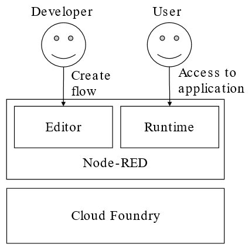
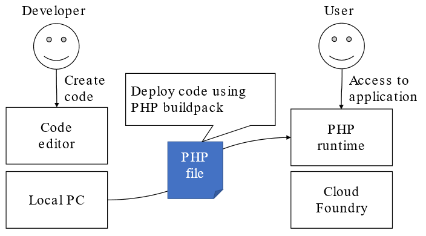
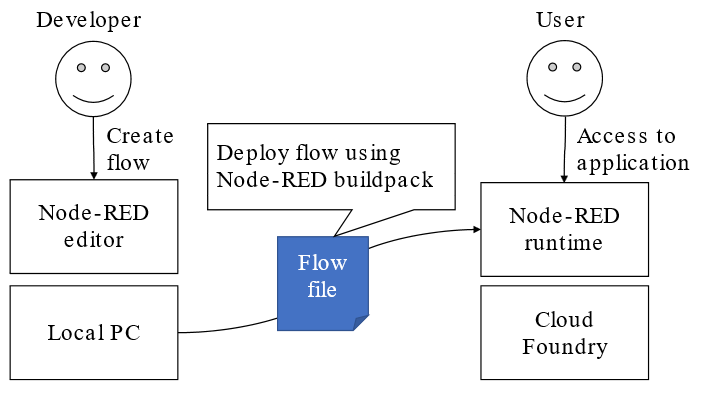

# Cloud Foundry Node-RED Buildpack

### Current architecture of Node-RED on IBM Bluemix
 Single Node-RED instance has two roles, both development environment(Editor) and flow execution environment(Runtime). Therefore developer and application users should access to single Node-RED instance. This architecture will be useful for PoC because developer easily modify the flow when users found bug or improvement idea. But it is rare architecture in terms of Cloud Foundry application.
 

### General deployment of application on Cloud Foundry
 In general, developer creates their code on local PC. After the coding, he/she deploy it into Cloud Foundry using cf push command. The following diagram shows an example of PHP application development.
 

### Deployment of Node-RED flow file using Node-RED buildpack
 Node-RED buildpack realizes common style of application development. After developer creates flow on local Node-RED environment, they can deploy it into Cloud Foundry. In detail, cf push command send only flow file. After that, Cloud Foundry builds Node-RED instance from the flow file using Node-RED buildpack. Node-RED buildpack will be useful for scaling instances and understanding Cloud Foundry.
 

### How to deploy
##### (1) Login to Cloud Foundry
> cf login -a <Cloud_Foundry_endpoint>
##### (2) Deploy flow using Node-RED buildpack
> cf push <application_name> -p <node-red_directory> -b https://github.com/zuhito/node-red-buildpack.git

### How to create flow on Windows and deploy it to Bluemix
##### (1) Start Node-RED on local Windows PC
> node-red
##### (2) Create flow and hit deploy(Save flow into the following path automatically)
> C:\Users\<user name>\.node-red\flows_<host name>.json
##### (3) Login to Bluemix
> cf login -a api.ng.bluemix.net
##### (4) Deploy flow using Node-RED buildpack
> cd C:\Users\<user name>\
> cf push <application_name> -p <node-red directory> -b https://github.com/zuhito/node-red-buildpack.git

